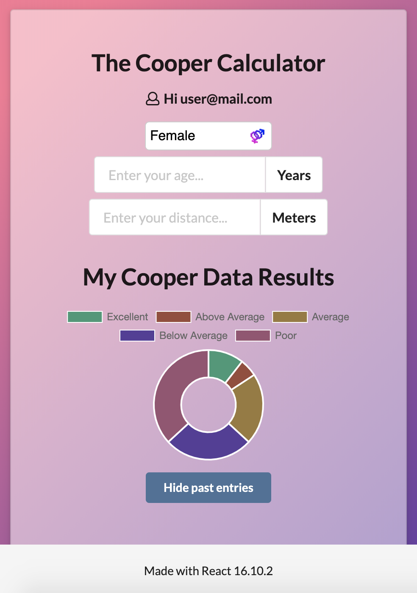

# The Cooper Challenge
### Author  
[Clarissa Liljander](https://github.com/clalil)  
[Sverrir Steindorsson](https://github.com/shsteindorsson)
## Built with  
**Front End:** React v.16.10.2, Semantic UI, CSS  
**Back End:** Rails 5.2.3   
**Testing frameworks:** Cypress, Enzyme  
**Deployed at:** [Netlify](https://cooper-clarissa-sverrir.netlify.com/) [](https://app.netlify.com/sites/cooper-clarissa-sverrir/deploys)  and [Heroku](https://www.heroku.com/).




## The code   
This repository contains our solution to the client side of the Cooper Challenge. Our respective repositories for the Cooper API built in Rails can be found [here](https://github.com/clalil/Cooper-Challenge-API) and [here](https://github.com/shsteindorsson/cooper_api).

## Getting started
### Dependencies  
* Yarn
* React
* Enzyme
* Cypress 
* Semantic UI for React
* Axios
* Chart.js
* react-chartjs-2    

### Setup   
To test this application you need to fork it to your own GitHub account and clone it to your local workspace.  

To install all of the dependencies:    
```
$ yarn install
```  
To run the unit tests:  
```
$ yarn test
```  
To start cypress and run the feature tests:  
```
$ yarn run cy:open
```
To start the application and run it on your local host:
```
$ yarn start
```

### Exploring the app online or in local host  
To be able to fully appreciate the software, one can log into the app with the following test-credentials:  

**Email:** `user@mail.com`  
**Password:** `password`

## Updates/Improvements  
Later on, we would like to:  
- Finish implementing the BMI calculator on the client side and add the save data functionality to it.  

## License  
This project is released under the [MIT-license](https://en.wikipedia.org/wiki/MIT_License).

### Acknowledgement  
Thank you [Craft Academy](https://craftacademy.se) for giving us this assignment.  

## Craft Academy's _Question of the week..._
In this project the calculation is performed on the client-side.  

### What are the pros and cons of client-side processing/calculation ?

#### Pros
- It can, under some circumstances, mean more processing power.
- It makes scaling easier because computational load is not increased with each new user.  
Only increases storage but does not increase computational load on server. Hence, less server-cost.

#### Cons
- Security, some processing should never be done client-side (banking f.ex.).
- Client-side resources can be more of an issue, f.ex. hardware capabilities and software compatibility on client-side.
- Software (calculations) can not be written in any language or framework.
- With server-side computation, more of the debugging is focused on a single target rather than, possibly, multiple client-side scenarios.
